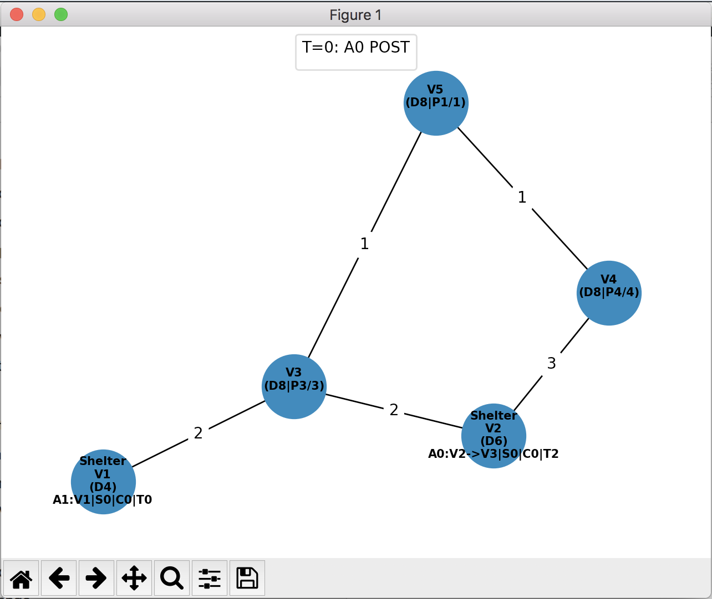
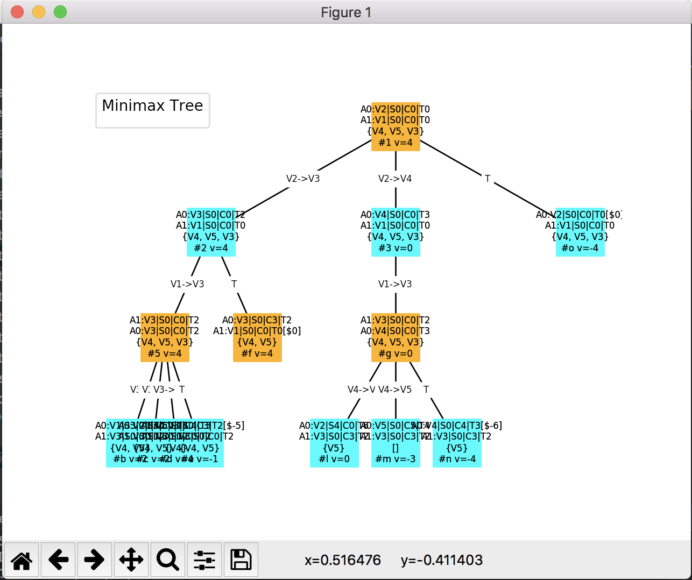

# AI_assignment2
This is the second assignment in "Intro to Aritificial Intelligence".
It's a hurricane evacuation simulator with Minimax based AI agents.
Allows adversarial, collaborative and semi-cooperative mode.
## Instructions:
```
usage: test.py [-h] [-g GRAPH_PATH] [-nn MAX_NEIGHBORS] [-K BASE_PENALTY]
               [-m {adversarial,cooperative,semi_cooperative}]
               [-t {goal,shelter}] [-L AGENT_LOCS AGENT_LOCS] [-q] [-s]

        Environment simulator for the Hurricane Evacuation Problem

optional arguments:
  -h, --help            show this help message and exit
  -g GRAPH_PATH, --graph_path GRAPH_PATH
                        path to graph initial configuration file
  -nn MAX_NEIGHBORS, --max_neighbors MAX_NEIGHBORS
                        for random configurations, limits the number of
                        neighbors for each node
  -K BASE_PENALTY, --base_penalty BASE_PENALTY
                        base penalty for losing an evacuation vehicle
  -m {adversarial,cooperative,semi_cooperative}, --mode {adversarial,cooperative,semi_cooperative}
                        game mode
  -t {goal,shelter}, --tie_breaker {goal,shelter}
                        tie breaker for same value nodes in the minimax tree
  -L AGENT_LOCS AGENT_LOCS, --agent_locs AGENT_LOCS AGENT_LOCS
                        agent locations by order. E.g "--agent_locs V1 V3" =>
                        initially A1 in V1, A2 in V3
  -q, --quiet           disable debug prints (enabled by default)
  -s, --skip_strategy   disable plotting search agents strategy trees (enabled
                        by default)
```  
### Examples: 
```
python test.py -g tests/all.config -L V2 V1 --mode cooperative -K 4
python test.py -g random --max_neighbors 4 --mode adversarial
```

### Graph visuals:
#### Environment representation:


#### Minimax decision tree representation:

